## Overview

MANAGE-WB is a recursive dynamic Computable General Equilibrium (CGE) model implemented in GAMS, developed by the World Bank for economy-wide policy analysis across a wide range of country contexts.

Given a country-specific Social Accounting Matrix (SAM) — built from the GTAP database and optionally refined with national accounts or other macro data sources — MANAGE-WB simulates how external and policy shocks such as trade policy changes, carbon taxes, public investment programs, or climate damages propagate through production, trade, labor markets, and household income over a multi-year horizon, producing year-by-year macroeconomic and sectoral projections relative to a baseline scenario.

The model is operated through a graphical user interface that guides users through database preparation, baseline calibration, and scenario simulation, with an extensible shock-file architecture that lets new policy scenarios be defined without modifying the core model code.

## Documentation

Full documentation is available at [https://www.worldbank.org/en/programs/economicpolicy-macro-modeling/cge](https://www.worldbank.org/en/programs/economicpolicy-macro-modeling/cge).

## Getting Started

### Prerequisites

- A computer with a Windows-based operating system
- A working installation of GAMS, version 39 or higher

### Installation

- Install [GitHub Desktop](https://desktop.github.com/download/).
- From [https://github.com/worldbank/MANAGE-WB](https://github.com/worldbank/MANAGE-WB), create a local copy of the repository. One way to do this is as follows:
  - In GitHub Desktop, select File and then Clone Repository.
  - Enter the URL `https://github.com/worldbank/MANAGE-WB` and choose a local path (for example, create a new folder).
  - Select Clone.
  - Press Fetch origin.
- Open the folder you created. You should see a subfolder named `MANAGE-WB`.
- The `MANAGE-WB` folder should contain the following subfolders and files.

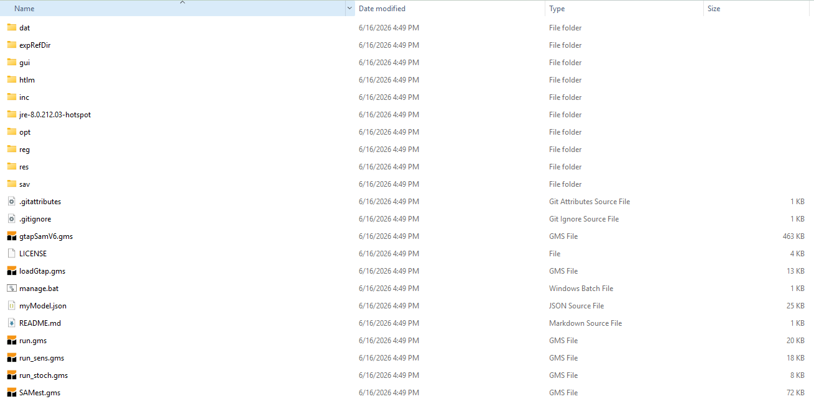
*Figure 1: Contents of the cloned MANAGE-WB folder.*
*Note: The exact layout of the folder shown might depend on your Windows settings.*

### Acronyms used in this manual

- **GUI** – Graphical User Interface
- **GTAP** – Global Trade Analysis Project (the source database)
- **SAM** – Social Accounting Matrix
- **BaU** – Business as Usual (the baseline scenario)
- **CCDR** – Climate Change and Development Report
- **AEZ** – Agro-Ecological Zone
- **GDX** – GAMS Data Exchange (GAMS's native data file format)
- **CNS** – Constrained Nonlinear System (a GAMS model/solve type)
- **MCP** – Mixed Complementarity Problem (a GAMS model/solve type)
- **DNLP** – Nonlinear Program with Discontinuous Derivatives (a GAMS model/solve type)

Throughout this manual, `xxx` denotes the ISO three-letter country code (e.g., GHA for Ghana), and `yyy` denotes the suffix you assign to a GTAP database when loading it (see *Loading GTAP Data*, step 1b) — for example 9, 11c, or 12.

## Usage

### Running the Application for the First Time

- Refer to Section 3, Model Implementation, in *MANAGE-WB Model Documentation* by Beyene, Britz, Christensen, Dudu, and Galindev (2025).
- Run `manage.bat` by double-clicking it. This opens the following window:

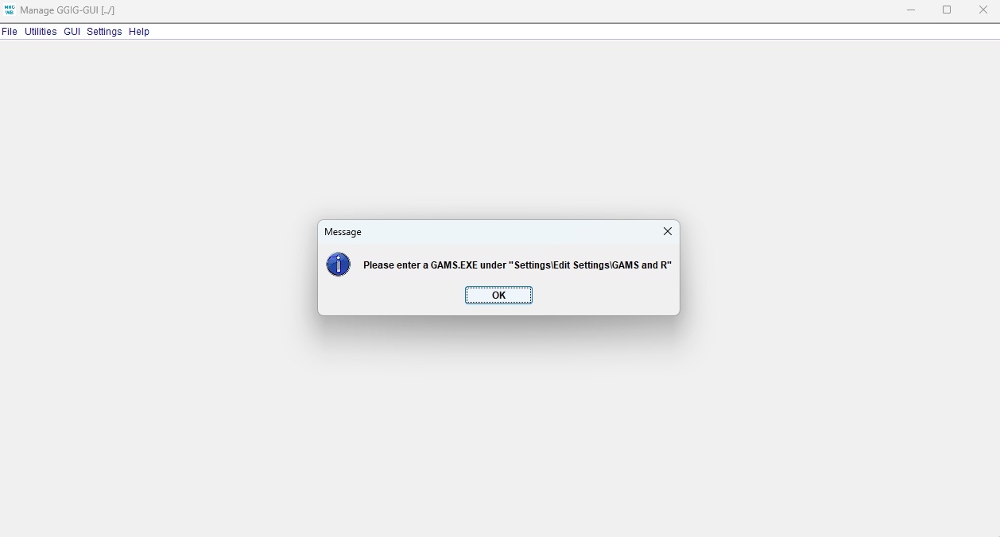
*Figure 2: Window that opens when manage.bat is run.*

- Selecting OK opens the MANAGE-WB graphical user interface (GUI):

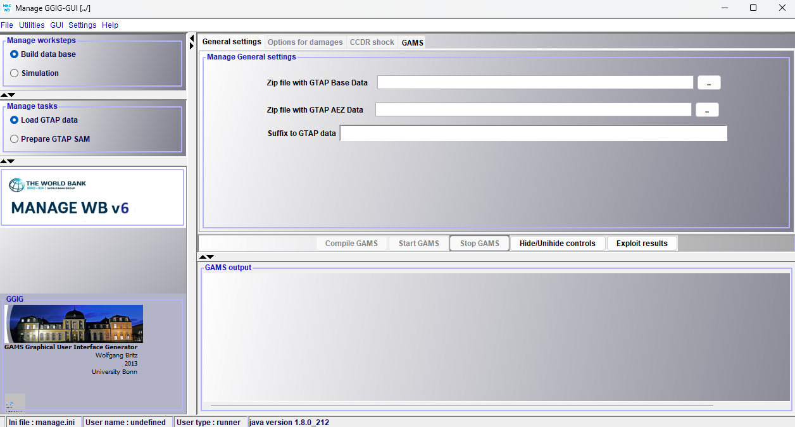
*Figure 3: The MANAGE-WB graphical user interface.*

- Refer to the section on the Graphical User Interface in *MANAGE-WB Model Documentation* by Beyene, Britz, Christensen, Dudu, and Galindev (2025).
- The screenshot above shows that there are 2 options under **Manage worksteps**:
  - Build data base
  - Simulation
- Currently, **Build data base** is selected, which has 3 options under **Manage tasks**:
  - **Load GTAP data**, currently selected in the above screenshot
  - **Prepare GTAP SAM**
  - **Match to macro SAM**, not currently visible in the above screenshot

### Settings

- Select Settings to open the following window:

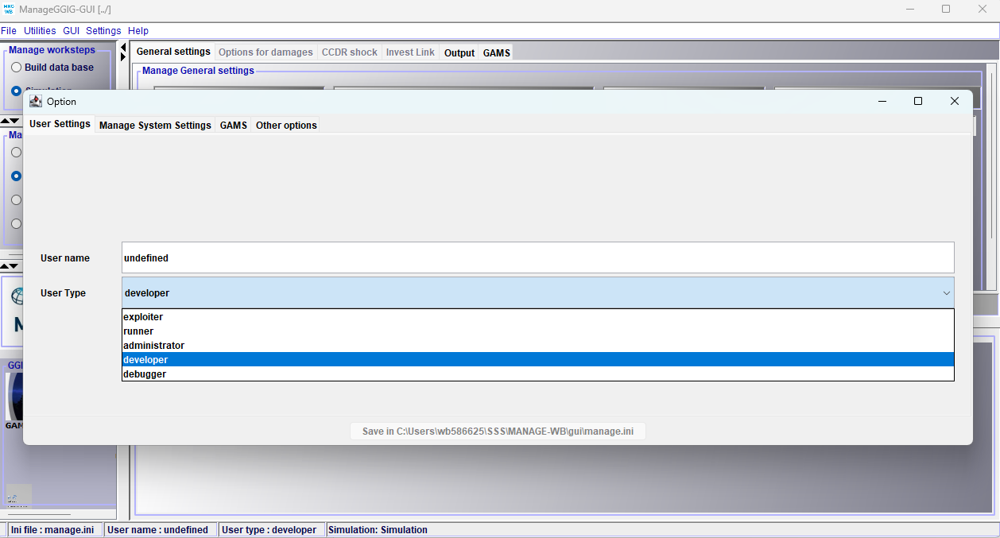
*Figure 4: The Settings window.*

- Under the **User Settings** tab, you can choose one of five user types:
  - Exploiter
  - Runner
  - Administrator
  - Developer
  - Debugger
- Under the **GAMS** tab, enter the path to `GAMS.exe` if the field is empty.

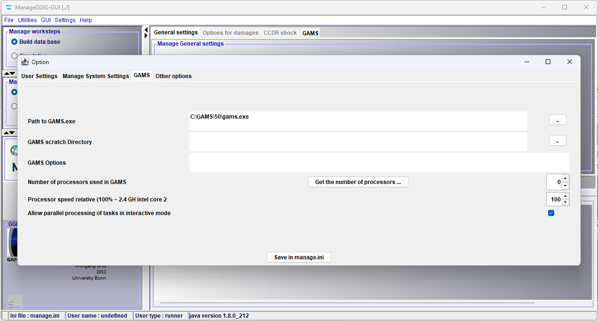
*Figure 5: The GAMS tab in Settings.*

- Under the **Other options** tab, replace the default text editor (`notepad.exe`) in the Path to Editor field with your preferred editor. In the example below, GAMS Studio is selected.

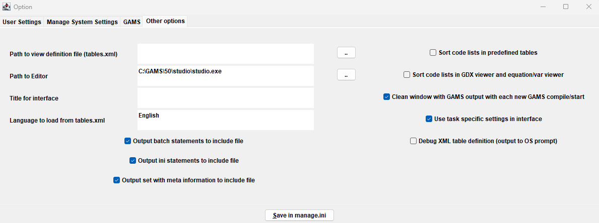
*Figure 6: The Other options tab in Settings, with GAMS Studio selected as the editor.*

- These changes, along with any other updates you make in this window, are written to `manage.ini` when you select Save and close the window.
- You are now ready to load GTAP data and build a country-specific SAM. For more details, refer to *MANAGE-WB Model Documentation* by Beyene, Britz, Christensen, Dudu, and Galindev (2025).

### Manage worksteps: Build data base

#### Load GTAP Data

- The screenshot below shows that you can load GTAP data, which could be GTAP11, GTAP12, and their other variations like Power.
- The ZIP files with GTAP Base Data, including AEZ data, can be selected from the stored location and loaded by pressing 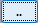.
- Fill in the Suffix to GTAP data field, such as 11c or 12. This is the suffix (`yyy`) that will later appear in downstream file names such as `BaseBridge_xxx_GTAP_yyy.xlsx`.
- By pressing **Start GAMS**, GAMS will create the GTAP database.

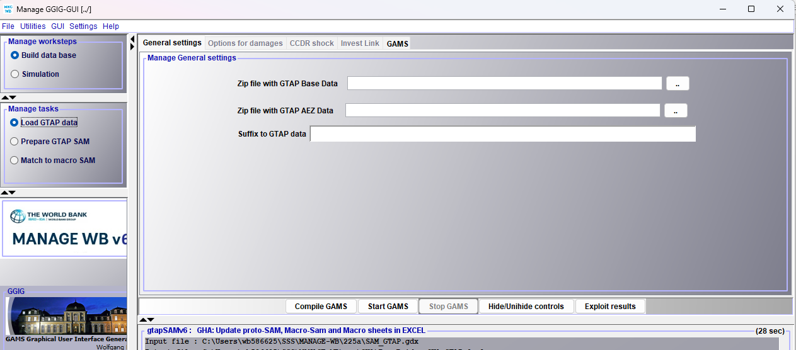
*Figure 7: The Load GTAP data screen.*

- The result will be a GDX file such as `gtapData11c.gdx` or `gtapData12.gdx`.
- `gtapData9.gdx` is already included in the package.

#### Prepare GTAP SAM

- Now select **Prepare GTAP SAM**. The following screenshot should be seen.
- Select your database from the dropdown menu under the **GTAP data base input** field — i.e., gtapData12, gtapData11c, or gtapData9.
- gtapData9 is included in the package, so it is selected as seen.

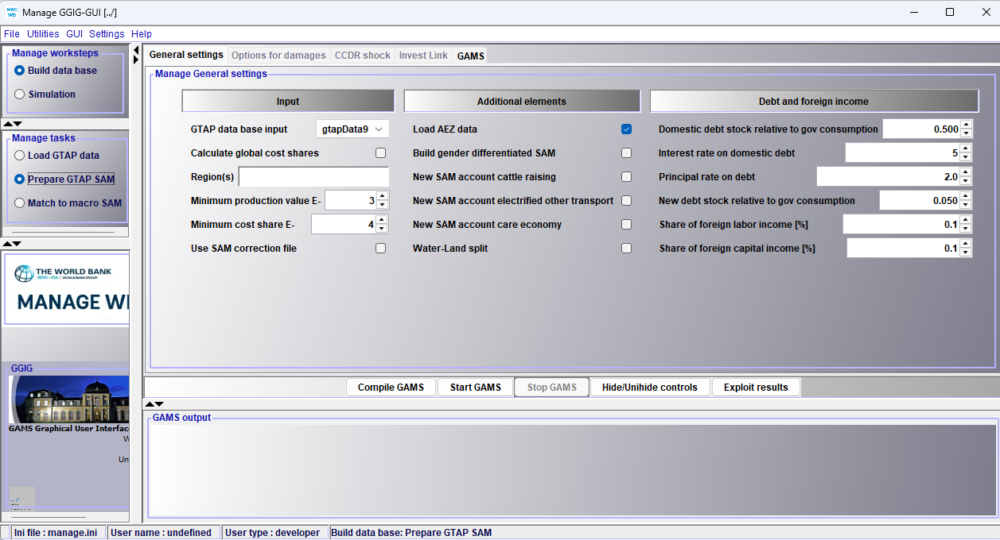
*Figure 8: The Prepare GTAP SAM screen, with gtapData9 selected as the input database.*

- In the **Region(s)** field, enter the ISO three-letter code for the country of interest, such as GHA for Ghana.
- You can also review and adjust the other options available in this window.
- Selecting **Start GAMS** generates the bridge file containing a SAM for the selected country, based on whichever GTAP database you chose above (gtapData9, gtapData11c, or gtapData12).
- You should then see the following message in the GUI:

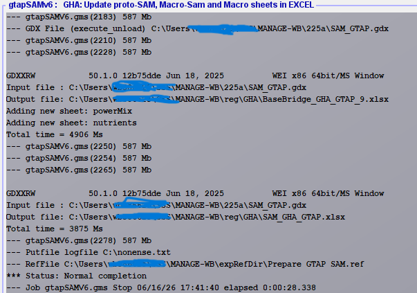
*Figure 9: Completion message after Prepare GTAP SAM finishes successfully.*

- If this message appears, a folder for the selected country is created in the `…\MANAGE-WB\reg` folder. For example, a GHA folder is created with:
  - `BaseBridge_GHA_GTAP_9.xlsx`
  - `SAM_GHA_GTAP.xlsx`

  both in `…\MANAGE-WB\reg\GHA`. Status: Normal completion.
- Inside the GHA folder, you should see the following contents:

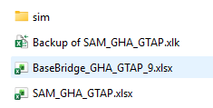
*Figure 10: Contents of the country-specific GHA folder.*

- For the contents of `BaseBridge_xxx_GTAP_yyy.xlsx` and `SAM_xxx_GTAP.xlsx`, refer to *MANAGE-WB Model Documentation* by Beyene, Britz, Christensen, Dudu, and Galindev (2025).

#### Match to macro SAM

- You can update the SAM by selecting **Match to macro SAM** in the GUI.
- Make the required changes in `SAM_xxx_GTAP.xlsx` (the file created in the previous step). The options could be:
  - **Macro SAM** – update the macro SAM to a more recent year, for example.
  - **SplitShr** – split a sector into multiple sectors, for example. In that case, you will need to update **Sets**.
  - **Fixes** – fix certain entries in the SAM.
- Select **Start GAMS** in the GUI. This reads your edits in `SAM_xxx_GTAP.xlsx` and uses them to update and rebalance `BaseBridge_xxx_GTAP_yyy.xlsx`.

### Manage worksteps: Simulation

Under the menu **Manage worksteps**, the next option is **Simulation**.

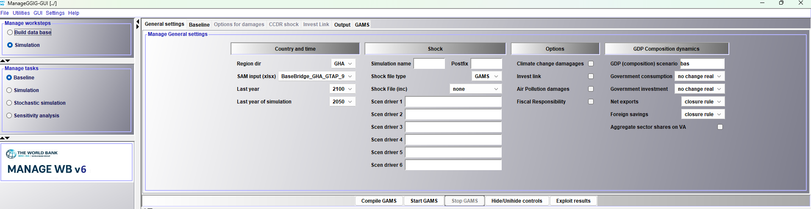
*Figure 11: The GUI with the Simulation workstep selected, showing the Manage tasks panel and the General settings tab for Baseline.*

**Simulation** has 4 options under **Manage tasks**:

- Baseline
- Simulation *(not to be confused with the Simulation workstep above — this is a task within it)*
- Stochastic simulation (only available when User Type is set to Developer under Settings)
- Sensitivity analysis (only available when User Type is set to Developer under Settings)

#### Baseline

The Baseline screen has the following tabs:

- **Always visible:** General Settings, Baseline, Output, GAMS
- **Conditionally visible**, depending on choices made under General Settings: Options for damages, CCDR shock, Invest Link

The screenshot above (Figure 11) shows the controls for the baseline simulation under the **General Settings** tab:

- Country and time
- Shock
- Options
- GDP Composition dynamics

Under the **Baseline** tab, you will see the following options for baseline building, as shown in the screenshot below:

- Data and checks
- Model configuration
- Productivity

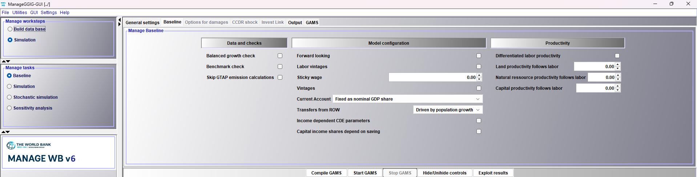
*Figure 12: The Baseline tab, showing Data and checks, Model configuration, and Productivity options.*

To activate the **Options for damages** tab, select Climate change damages under Options, under the General Settings tab. You will then see the following:

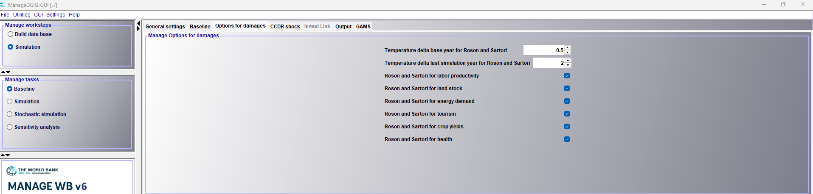
*Figure 13: The Options for damages tab.*

To activate the **CCDR shock** tab, select ccdr as a shock file from the Shock File dropdown menu under Shock, under the General Settings tab. You will then see the following. For more information, refer to *MANAGE-WB Model Documentation* by Beyene, Britz, Christensen, Dudu, and Galindev (2025).

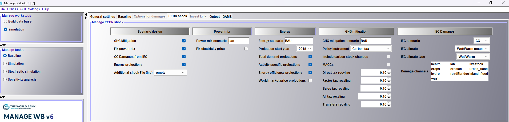
*Figure 14: The CCDR shock tab.*

To activate the **Invest Link** tab, select Invest Link under Options, under the General Settings tab. You will then see the following. For more information, refer to *MANAGE-WB Model Documentation* by Beyene, Britz, Christensen, Dudu, and Galindev (2025).

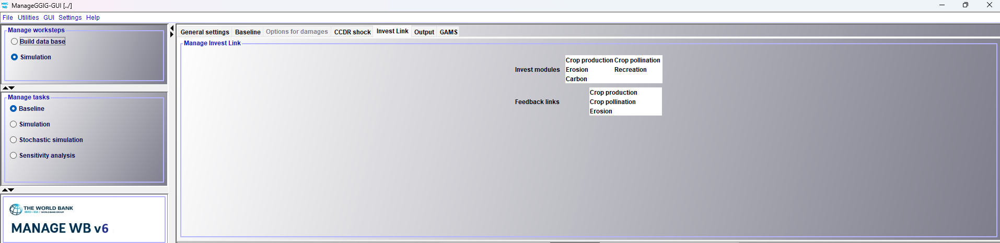
*Figure 15: The Invest Link tab.*

The **Output** tab has the following information. For more information, refer to *MANAGE-WB Model Documentation*.

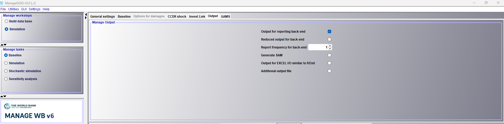
*Figure 16: The Output tab.*

The **GAMS** tab gives many built-in options related to GAMS, organized into 4 main columns:

- Options for listing
- Initialization
- Solver control
- Options for solve outputs

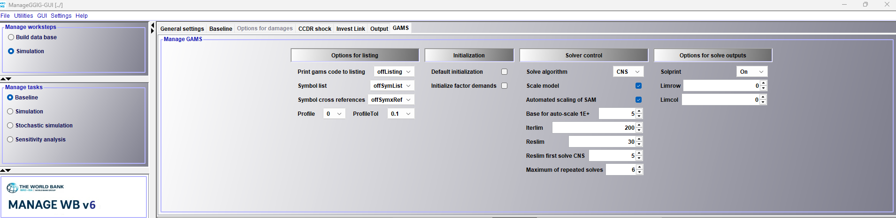
*Figure 17: The GAMS tab, showing the four columns of built-in GAMS options.*

For instance, Solve Algorithm has options including CNS, MCP, and DNLP. For more information, refer to *MANAGE-WB Model Documentation*.

After making your choices across these tabs, press **Start GAMS**. The result will be produced in `…\MANAGE-WB\res\xxx` as a GDX file — e.g., `…\MANAGE-WB\res\GHA\GHA_BaU.gdx`.

#### Simulation (task)

The baseline results stored in `xxx_BaU.gdx` can now be used for various counterfactual simulations. Choosing **Simulation** under Manage tasks shows the following:

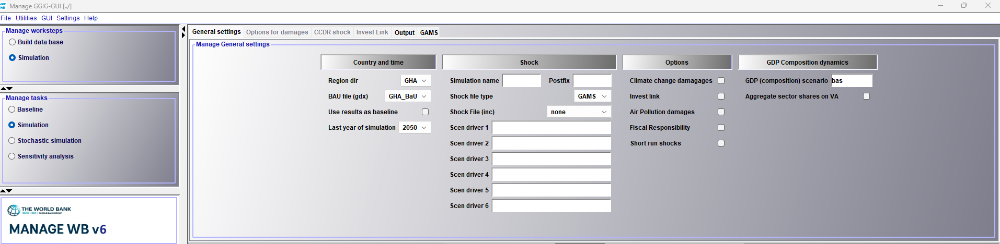
*Figure 18: The Simulation task screen.*

- `GHA_BaU.gdx` is selected as the BaU file (gdx).
- Shock file (inc) defaults to `none.inc`, which is included in the package and found in `…\MANAGE-WB\reg\xxx\sim`, along with several other ready-made shock files in the same location.
- You can select a different shock file from the dropdown menu, or alter any existing shock file for your own purposes.
- `none.inc` and `empty.inc` are both provided as starting points for creating your own shock file.
- The counterfactual simulation results are stored in the `res` folder under the country name as GDX files.
- For more information about shock files, refer to *MANAGE-WB Model Documentation* by Beyene, Britz, Christensen, Dudu, and Galindev (2025).

#### Exploit results

You can see and compare your simulation results by selecting the **Exploit results** button. More information is given in *MANAGE-WB Model Documentation*.

## Contact

For questions or feedback, please reach out to [manage_wb@worldbank.org](mailto:manage_wb@worldbank.org).

## License

This project is licensed under the MIT License together with the [World Bank IGO Rider](https://github.com/worldbank/MANAGE-WB/blob/main/WB-IGO-RIDER.md). The Rider is purely procedural: it reserves all privileges and immunities enjoyed by the World Bank, without adding restrictions to the MIT permissions. Please review both files before using, distributing, or contributing.
